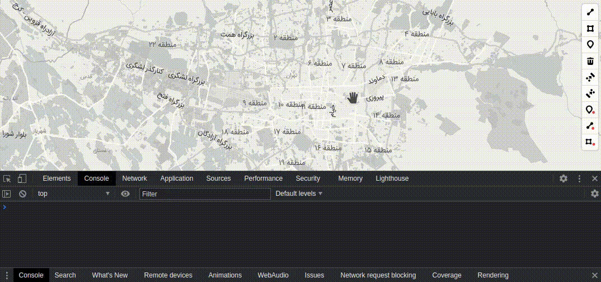

# Mapbox-GL Draw Passing Mode


Custom mode for [Mapbox GL Draw](https://github.com/mapbox/mapbox-gl-draw) that adds passing drawing, the ability to draw features but doesn't add them.
this can be used whenever there's a need to draw features to manipulate others, e.g., when cutting or splitting features.

## Demo

See a full example in the docs folder, or check at the [**Demo**](https://mhsattarian.github.io/mapbox-gl-draw-passing-mode).



## install

```shell
npm i mapbox-gl-draw-passing-mode
```

## usage

```js
import mapboxGlDrawPassingMode from "mapbox-gl-draw-passing-mode.js";

const draw = new MapboxDraw({
  modes: {
    ...MapboxDraw.modes,
    passing_mode_point: mapboxGlDrawPassingMode(MapboxDraw.modes.draw_point),
    // Passing Callback to handle drawn feature
    passing_mode_line_string: mapboxGlDrawPassingMode(
      MapboxDraw.modes.draw_line_string,
      (feature) => {
        console.log(feature);
      }
    ),
    passing_mode_polygon: mapboxGlDrawPassingMode(
      MapboxDraw.modes.draw_polygon
    ),
  },
});

draw.changeMode("passing_mode_line_string");
```

when activated, these modes act like Mapbox Gl Draw default modes (`draw_point`, `draw_line_string`, and `draw_polygon`), only they don't add the feature to the map, therefore no `draw.create` event is fired.

To handle drawn features, instead of using `draw.create` event, you can pass a **callback** or use the **`draw.passing-create` event** (fired after feature is drawn and only if **callback** is not provided).

## acknowledgement

The inspiration is from the [Radius Mode](https://gist.github.com/chriswhong/694779bc1f1e5d926e47bab7205fa559) created by @chriswhong and the discussion [here](https://github.com/mapbox/mapbox-gl-draw/issues/767#issuecomment-384833953).
